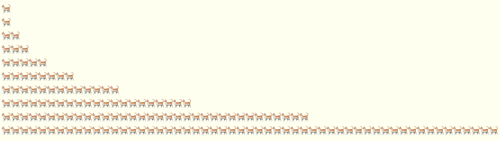

# 喵语言（meowlang）

喵语言（Meowlang）是一种专门为猫咪设计的深奥编程语言（esoteric programming language）。

## 使用喵语言解释器

请用浏览器访问[喵语言解释器](https://pingpingze.com/meowlang/index.zh.html)。

## 从源代码运行

### 开发环境设置

```shell
yarn
```

### 从命令行运行解释器

运行一个喵语言程序：

```shell
node . -i examples/hello.meow
```

```shell
node . -i examples/fibonacci.meow
```

运行喵语言程序时打开调试开关：

```shell
node . -i examples/fibonacci.meow -d
```

### 在本地启动Web方式的解释器

启动本地Web服务器：

```shell
yarn start
```

## 喵语言示例

喵语言程序可以用猫的表情符号打印出斐波那契数列：



打印斐波那契数列的喵语言程序如下。参见[Fibonacci source
code](examples/fibonacci.meow)。以下代码用英语口音的“喵”（meow）写成:

```text
MeowMeowMeowMeowMeowMeowMeowMeow;
MeowMeowMeowMeow;
Meow;
Meow;
MeowMeow;
MeowMeowMeowMeowMeowMeowMeowMeowMeowMeow;
MeowMeowMeowMeow;
MeowMeow;
Meow;
;
MeowMeowMeow;
MeowMeowMeowMeow;
MeowMeow;
MeowMeowMeowMeow;
MeowMeowMeow;
MeowMeowMeowMeowMeowMeow;
MeowMeowMeowMeow;
MeowMeowMeow;
MeowMeowMeowMeowMeow;
MeowMeow;
MeowMeowMeow;
MeowMeowMeowMeowMeow;
MeowMeowMeow;
MeowMeowMeow;
MeowMeow;
Meow;
MeowMeowMeowMeowMeowMeowMeow;
MeowMeowMeowMeowMeowMeowMeowMeowMeow;
MeowMeowMeowMeowMeowMeowMeowMeowMeowMeowMeowMeowMeowMeowMeowMeowMeowMeowMeowMeowMeowMeowMeowMeowMeowMeowMeowMeowMeowMeowMeow;
MeowMeowMeowMeowMeowMeowMeowMeow;
MeowMeowMeowMeowMeowMeow;
MeowMeowMeow;
MeowMeowMeowMeowMeowMeowMeowMeowMeowMeow;
```

用汉语口音的“喵”写成的斐波那契数列代码如下。参见[Fibonacci source
code](examples/fibonacci.zh.meow)。

```text
喵喵喵喵喵喵喵喵;
喵喵喵喵;
喵;
喵;
喵喵;
喵喵喵喵喵喵喵喵喵喵;
喵喵喵喵;
喵喵;
喵;
;
喵喵喵;
喵喵喵喵;
喵喵;
喵喵喵喵;
喵喵喵;
喵喵喵喵喵喵;
喵喵喵喵;
喵喵喵;
喵喵喵喵喵;
喵喵;
喵喵喵;
喵喵喵喵喵;
喵喵喵;
喵喵喵;
喵喵;
喵;
喵喵喵喵喵喵喵;
喵喵喵喵喵喵喵喵喵;
喵喵喵喵喵喵喵喵喵喵喵喵喵喵喵喵喵喵喵喵喵喵喵喵喵喵喵喵喵喵喵;
喵喵喵喵喵喵喵喵;
喵喵喵喵喵喵;
喵喵喵;
喵喵喵喵喵喵喵喵喵喵;
```

## 喵语言（Meowlang）技术规范

### 喵列表（Meow List）

一个合法的喵语言程序其实是一个喵列表（Meow List）的文本形式.

一个喵列表是由一系列喵元素组成的。

每个喵元素包含零个或多个喵符号（Meow token）。每个喵元素中，喵符号的数量对应于一
个非负整数。该非负整数就是喵元素的值。

根据上下文语义，每个喵元素有时可以被视作一条喵指令（Meow instruction），有时也可
以被视作一个喵操作数（Meow operand）：

* 当喵元素被视作一条喵指令时，喵元素的值就是该指令的代码（opcode）。
* 当喵元素被视作一个喵操作数时，喵元素的值就是该操作数的值。

在喵语言的运行环境中，内存中的喵列表是一个可读可写的列表。这个列表不仅是程序要执
行的指令序列，也是每条指令在运行期间唯一能访问的内存数据结构。

换句话说，代码即数据，数据即代码。

### 喵符号（Meow Tokens）

一个喵符号就是用文本方式表示的一声猫叫。喵语言支持以下不同口音的猫叫形式，它们在
程序中可以任意互换使用：

* 英语口音：`Meow`
* 法语口音：`Miaou`
* 汉语口音：`喵`
* 汉语拼音口音：`Miao`

喵符号在程序中不区分大小写。例如, `Meow`、`meow`、`MEOW`都是同样的喵符号。

### 喵语言程序的文件格式

文本方式的喵语言程序用分号`";"`来结束每个喵元素。

例如，以下代码包含5个喵元素，他们的值分别是0，1，2，3，4：

```text
;
Meow;
Meow Meow;
Meow Meow Meow;
Meow Meow Meow Meow;
```

喵语言程序中的空白字符如`" "`、`"\t"`、`"\n"`仅用于格式化目的，在程序执行时会被
忽略。你可以使用空白字符将程序排版成任意有趣的形式。例如，下面的代码与上面的代码
是完全等价的：

```text
; M e o w ; MeowMeow ; MeowMeowMeow ; MeowMeowMeowMeow ;
```

不同口音的喵符号可以在代码中混合使用，例如：

```text
;
喵;
Meow Miao;
Miaou Miaou Miaou;
Miaou 喵 Meow Miao;
```

建议喵语言程序的文件使用后缀`".meow"`.

### 简化版喵语言程序的文件格式

一个喵语言程序可以用一系列非负整数来表示。用简化格式存储时，每个非负整数分行存储在文件中，
每行对应于一个喵元素。例如：

```text
0
1
2
3
4
```

这种简化版的喵语言程序建议使用文件后缀`".smeow"`.

### 喵指令集（Meow Instruction Set）

| 指令代码 | 指令名称 | 指令含义 | `IP`操作 |
|--------|------|-------------|----------------|
| 0 | `RET` | 打印输出一个换行符 `"\n"` | `IP++` |
| 1 | `MEOW` | 打印输出 `T` 个猫咪符号 | `IP++` |
| 2 | `PUSH` | 将 `N` 压入喵列表的尾部 | `IP += 2` |
| 3 | `POP` | 将喵列表尾部的最后一个元素弹出 | `IP++` |
| 4 | `LOAD` | 将 `E(N)` 压入喵列表的尾部 | `IP += 2` |
| 5 | `SAVE` | 将喵列表尾部最后一个元素的值复制到 `E(N)` | `IP += 2` |
| 6 | `ADD` | 将喵列表尾部最后两个元素的值相加，从尾部弹出这两个元素，然后将相加的结果压入喵列表的尾部 | `IP++` |
| 7 | `SUB` | 将喵列表尾部最后两个元素的值相减（倒数第二个减去倒数第一个），从尾部弹出这两个元素，然后将相减的结果压入喵列表的尾部 | `IP++` |
| 8 | `JMP` | 将 `IP` 设置为 `N` | `IP = N` |
| 9 | `JE` | 如果喵列表尾部最后一个元素的值是 0，则将 `IP` 设置为 `N`，否则 `IP` 增加 2 | `IP = (T == 0) ? N : IP + 2` |
| >=10 | `NOP` | 无操作 | `IP++` |

* `IP`: 指令指针（Instruction Pointer），指向 Meow List 中当前要执行的指令位置。程序刚开始运行时，IP 的值为 0。
* `T`: 喵列表尾部最后一个元素的值。
* `N`: 当前指令所在元素的下一个元素的值。
* `E(N)`: 喵列表中的第 N 个元素。N 是当前指令所在元素的下一个元素的值。
